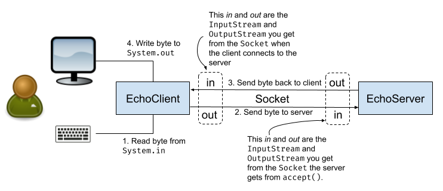

[](../../actions?query=workflow%3A"Java+CI")

# Echo Client & Server <!-- omit in toc -->

- [Overview](#overview)
- [Socket resources](#socket-resources)
- [The echo client/server](#the-echo-clientserver)
- [How does all this end?](#how-does-all-this-end)
- [Bats testing](#bats-testing)
- [Manual testing](#manual-testing)
  - [Testing your server](#testing-your-server)
  - [Testing your client](#testing-your-client)
- [To Do](#to-do)

## Overview

This lab explores the idea of client-server organization.  In a client-server
configuration one central machine called the **server** acts as the source
for some resource or service.  Other machines known as **clients** utilize the
resource or service provided by the server.  A good example would be a web-server
providing web-pages to multiple browsers on multiple computers.

(Note that the "server" could actually be a whole cluster of (virtual)
machines that collectively provide the desired service. Such clusters are
often configured so there is a single domain name or IP address that clients
use, so it still looks to them like there's a single machine providing the
service.)

The term **client-server** refers to the configuration of the service provider and
service consumer.  It does not require multiple machines. It is possible for the same
computer to act as server and as client.

In this lab we'll use Java implement a simple, socket-based client-server
system (the echo client and server). In development you'll likely just run
both the client and server code on the same machine, but you (fairly easily)
run them on different machines if you want to see that "in action".

A _socket_ is a common networking tool that provides two-way communication
between a pair of (not necessarily distinct) computers. Each computer has the
ability to write data (ultimately a stream of bytes) _to_ the socket on their
end, and read data (also a sequence of bytes) _from_ the socket. See the figure
below for an example of socket communication.

One of the big wins of using sockets (even for communication within a single
machine) is that the code for the client and server can be written entirely
independently, as long as the calling structure (the API, essentially) has been
agreed upon. It is often the case, for example, that the client and server are
written in different languages, e.g., JavaScript in the browser for the client,
and Java or Rust for the server.

Raw socket programming can actually be quite tricky. Luckily most modern
languages (including Java) provide nice socket libraries that abstract away
a lot of the underlying details and allow us to just treat a socket as a
pair of streams: An _input stream_ for reading from the socket, and an _output
stream_ for writing to the socket.

## Socket resources

You might find it useful to review and run this
[Date Server example](https://gist.github.com/NicMcPhee/2060037163d0d7fb475b5e4395b9ec32).
This sample program does many (but
not all) of the important things (including the socket work). The one
big difference there is that the `DateServer` returns a single string
and quits, where the `EchoServer` should continue to echo back its input.
That said, the socket work in this example should be helpful.

[The Java "All About Sockets" tutorial](https://docs.oracle.com/javase/tutorial/networking/sockets/index.html)
covers all the key pieces for this
lab. There's a warning at the top about it being written for Java 8, but
nothing has changed in the socket libraries since then that would affect
this lab.

You probably want to review the API docs for the relevant Java classes
(e.g., `Socket` and `ServerSocket`, but also perhaps `InputStream` and
`OutputStream`).

## The echo client/server

Both as a way of gaining some experience with socket programming and as
example of building both ends of a client/server system, we'll build
what's called an *echo server*. An echo server is a server that echoes
back whatever it receives from a client. The starter code and tests are
in this Github repo.

Your server should wait for a client
connection on the port specified by the instructor using `Socket.accept()`.
When a connection is made, the server should repeatedly:

- Read some data from the socket
- Write that data back to the client

The server should continue this until the client breaks the connection.
After the connection is closed, the server should go back to listening
for new connections. Your server should be able to handle binary data as
well as text data (more on this below).

Your *client* should take a
command line argument that is a hostname (e.g., `some.computer.edu`). The
server code will be assumed to be running on that host, and the client
will (try to) connect to that server. Note that if you get this right,
your client should be able to talk to any other group's server, and vice
versa.

The recommended approach is illustrated in this diagram:



Here the idea is to have the client repeatedly:

- Read a single byte from the keyboard (step 1 in the diagram)
- Send a single byte to the server (step 2)
- Read a single byte from the server (step 3)
- Print that byte (step 4)

Similarly, the server should repeatedly:

- Read a single byte from the client (step 2)
- Write that same byte back to the client (step 3)

:bangbang: People often try to do this in other ways, but this almost always
ends up trying to use Strings or some other text type, and that just doesn't work
for binary data. So try to resist the urge to step away from bytes as the
primary communication type.

The solution to this is very short (not much different than the
size of the `DateServer` example), so the trick isn't to write a lot
of code, but it's to get the code right. There are a few things
that tend to hang people up here:

- Using `read()` and `write()` to do byte-oriented I/O. Since you
  need this to handle binary content (things like JPGs), you can't
  use text oriented I/O (things like `Scanner`s, `BufferedReader`s,
  and `PrintWriter`s) because they tend to mangle binary data.
- You may find it necessary to call `flush()` on your output
  somewhere. When you write to an OutputStream the system may
  buffer those bytes to send a bunch as a group for
  efficiency reasons. If you know there are no more bytes coming,
  you can use `flush()` to force the system to send what it has.

## How does all this end?

A common problem is "ending" everything cleanly and correctly. The
first thing to note (as illustrated in the diagram) is that the data
flows from `System.in` through the client to the server, then back
from the server to the client, and ultimately to `System.out`.

This implies that the _client_ is the component that knows that when
"we're done", i.e., when `System.in` is doing sending information. This
could happen because we're reading from a file and we've reached the end
of that file, or we're reading from the keyboard and the user typed
`^D` (`Control-D`) to indicate that they're done entering data.

At that point the client needs to tell the server that it's not going
to send it anymore data. :bangbang: You do _not_ want to do this by
closing the `OutputStream` or the `Socket`. If you do, then there could
be data still on the server waiting to be sent back to the client, and it
can get stranded there if you close things before everything has been
written back. The client instead should call `shutDownOutput` on the
socket; this tells the socket that the client will never send more output
to the socket (i.e., step 2 will never happen again).

That means that when the server tries to read from _its_ input stream,
it will get nothing, similar to the end-of-file on `System.in` for the client.
That tells the server that it's done, so it can call `shutDownOutput` on its
version of the socket, saying that step 3 will never happen again.

The client is then informed that it will never get anything more from the
socket. At that point it makes sense for the _client_ to close the socket,
because we now know that everyone has processed all of their content and
there's no data that can be stranded if we close the socket.

## Bats testing

You have functional tests for this part of the lab, using the
[`bats` testing framework](https://github.com/sstephenson/bats).
In order for this to work
with Java, your project needs the specific directory structure provided
in the starter repo. The code has three folders:

- `src`, which holds the `.java` files where your code resides, and where the `.class`
  files will live when the tests run your code.
- `test`, which has three `bats` test scripts, along
  with two other things: an `etc` folder which has several sample
  files you could use to test your code manually (see below), and a
  `sampleBin` folder that has working class file versions of the Echo
  Server and Echo Client, so you can test the two components independently.

The three test scripts are:

- `Echo_client.bats`, which tests your _client_ but uses our server implementation in
  `sampleBin`. You can use this to test your client without having implemented your server yet, or use it to help isolate whether a problem is in your client or your server.
- `Echo_server.bats`, which tests your _server_ but uses the client implementation in
  `sampleBin`. You can use this to test your server without having implemented your client yet, or use it to help isolate problems again.
- `Echo_servers_and_clients.bats`, which runs tests using both your client and server
  (so without using any of the class files in `sampleBin`). Ultimately this is what you want to be able to run and have pass.

## Manual testing

Testing this by hand can suffer from a chicken-and-egg problem, as you arguably have to
have the server finished before you can test the client, and vice versa. As mentioned
above, we have provided working class files for both the client and server in `test/sampleBin` which you can use to test your work.

### Testing your server

Let's imagine that you want to test your server implementation. You should start your
server with:

```bash
java echoserver.EchoServer
```

:bangbang: Make sure you're in the directory _containing_ the `echoserver` package
directory when you run this command. People often make the mistake of being _in_
the `echoserver` directory and typing `java EchoServer`, which won't work.

Once your server is running you can then use _our_ client to test your server. In a
different terminal window go to `test/sampleBin` and run:

```bash
java echoserver.EchoClient
```

Then you can type things at that client, and you should get them back.
:bangbang: Because of the way the keyboard input buffering works, you'll
probably get your responses on a per-line basis, but that's not something
you need to worry about in your implementation.

If that seems to work, you can try it out on a binary file with something like:

```bash
java echoserver.EchoClient < test.jpg > output.jpg
```

where you replace `test.jpg` with any binary file (a JPEG, PNG, MP3, etc.).

If everything's working, the command above should send the contents of `test.jpg` to
to the server, which should send them back, and then your client will
write them to standard output, which in this case is redirected into
`output.jpg`. You can then use

```bash
diff test.jpg output.jpg
```

to see if the newly generated output file (`output.jpg`) is in fact
identical to the input file (`test.jpg`). You can do this with any
binary file (JPEGs, MP3s, Java class files, etc.); JPEGs have the
advantage that you can often open incomplete JPEG files and they'll just
show a monochrome block (usually in the bottom right corner) or
stripe (usually along the bottom) that
corresponds to the missing data. Since a common problem with this
problem is failure to deliver all the data (usually because of a failure to
call `flush()` at the end of writing data before closing sockets/streams),
this allows you to see that
most of your system was working, but that you lost a bit on the end.

When things seem right, run the `bats` tests for the server as described above
and hopefully everything will pass.

### Testing your client

Testing your client is essentially the same, but you start our server
(in `test/sampleBin`) and then run your client. You can do all the same
tests discussed up above.

Again, when things seem right, run the `bats` tests for the client.

## To Do

The canvas rubric provides detailed information on how you will be graded.  The main topics revolve around

- [ ] Getting the Echo client tests to pass
- [ ] Getting the Echo server tests to pass
- [ ] Making sure everything is clean and readable/maintainable
- [ ] Code and commits should be understandable and useful
